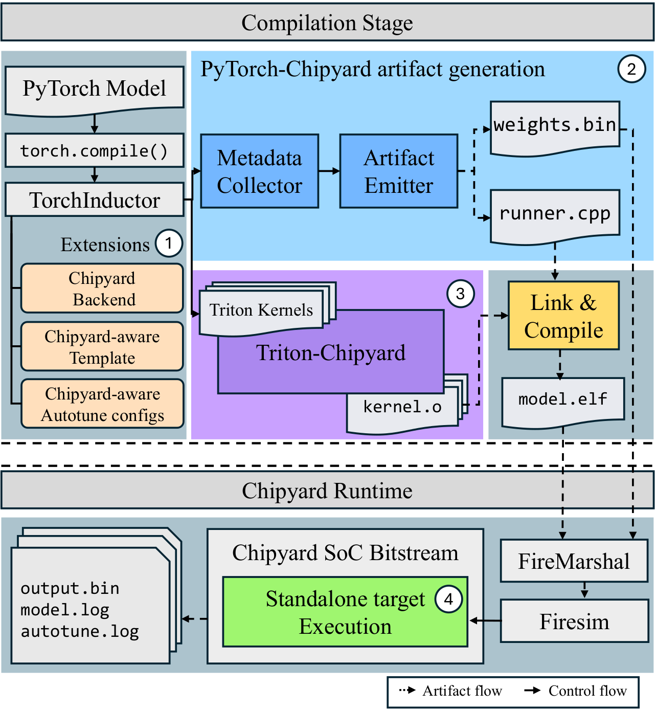
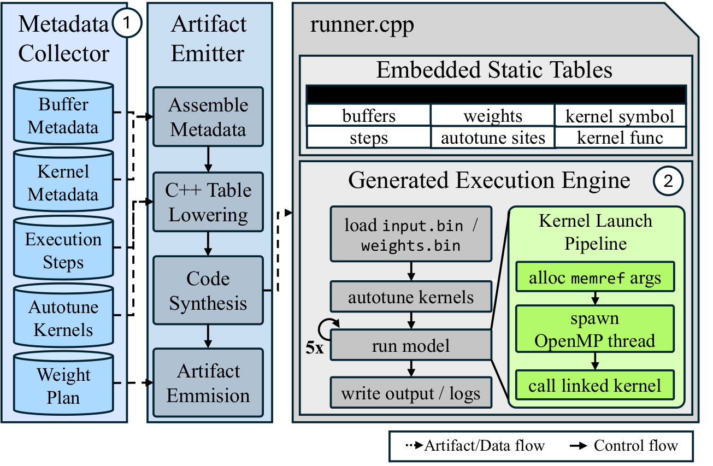
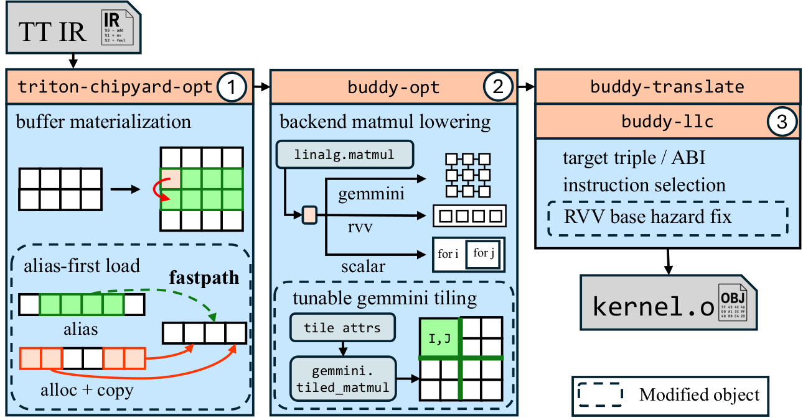

# Overview

PyTorch-Chipyard converts PyTorch models captured by `torch.compile` into
RISC-V/Gemmini-oriented artifacts that can be executed through Chipyard. Users
run a normal PyTorch model entry point and receive generated files such as
`runner.cpp`, `model_spec.json`, `weights.bin`, `input.bin`, and `build.sh`.
Those artifacts are then consumed by the Chipyard/FireSim execution stage.



The compilation flow is:

```text
PyTorch model
  -> torch.compile / TorchDynamo / FX graph
  -> TorchInductor lowering and scheduling
  -> Triton kernels
  -> Triton-Chipyard backend
  -> MLIR / Buddy-MLIR / Gemmini or RVV lowering
  -> runner.cpp, model_spec.json, weights.bin, input.bin, build.sh
  -> Chipyard / FireSim execution
```

## PyTorch-Chipyard

The top-level goal of PyTorch-Chipyard is to compile an entire PyTorch model in
the host runtime and package the result as a self-contained artifact directory
for Chipyard execution. The custom PyTorch checkout in this repository extends
TorchInductor with a Chipyard backend path and model-runner artifact generation.

The main PyTorch-side changes are:

- CPU targets are routed to the Triton-Chipyard backend when
  `torch._inductor.config.cpu_backend = "triton_chipyard"`.
- Model parameters, buffers, and runtime inputs are classified separately and
  recorded in `weights.bin`, `input.bin`, and `model_spec.json`.
- Kernel launch order, buffer layout, input/output shapes, strides, and storage
  offsets produced by Inductor become the contract shared by `runner.cpp` and
  `model_spec.json`.
- Operators that can produce multiple Inductor template candidates, such as
  matmul, convolution, and attention, are recorded as deferred autotune sites so
  the generated runner can choose using target cycle measurements.
- Several lowering and template paths needed by Chipyard execution are extended,
  including pooling, convolution, BMM, and FlexAttention paths.



`model_spec.json` is the source of truth for an artifact directory. If
`runner.cpp`, `weights.manifest.json`, `util.py`, `input.bin`, and `output.bin`
appear inconsistent, first inspect the input, weight, buffer, output, and kernel
metadata in `model_spec.json`.

## Triton-Chipyard

Triton-Chipyard is an out-of-tree Triton backend. In the PyTorch-Chipyard flow,
Inductor-generated Triton kernels are sent to this backend. Triton-Chipyard can
also be used on its own to lower standalone Triton kernels.

The Triton-Chipyard backend is responsible for:

- Lowering Triton IR into Triton-shared-style MLIR based on the
  Linalg/Tensor/Memref dialects.
- Running lowering passes needed by Buddy-MLIR and Chipyard/Gemmini execution.
- Reading target features and ABI settings for Gemmini, RVV, and scalar RISC-V
  targets from environment variables.
- Running a standalone Triton kernel through the Verilator simulator from host
  Python when `CHIPYARD_SIM_VERILATOR_PATH` is set, then copying results back to
  tensors.
- Prioritizing artifact generation and `runner.cpp`-based model execution for
  the PyTorch model path rather than direct single-kernel launches.


